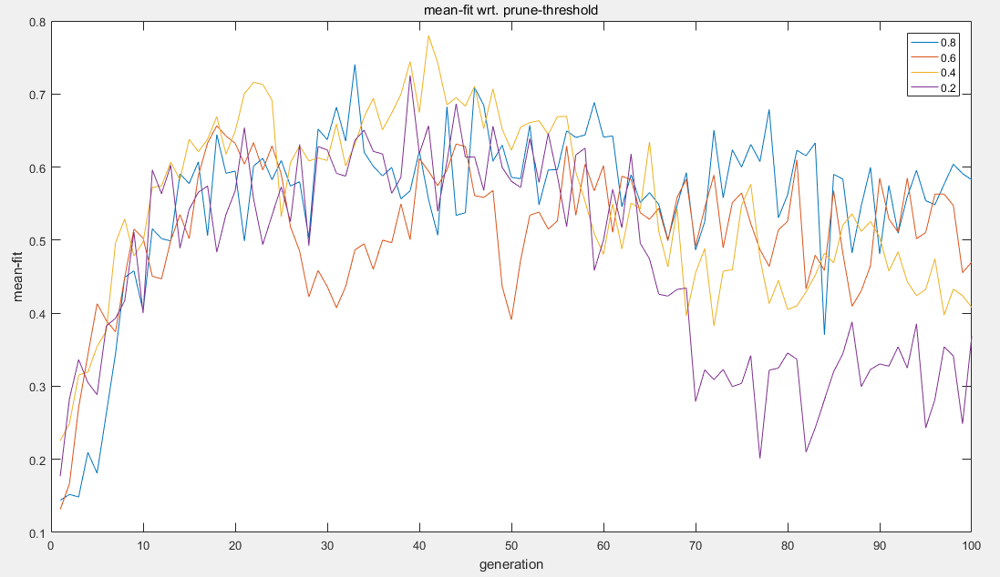
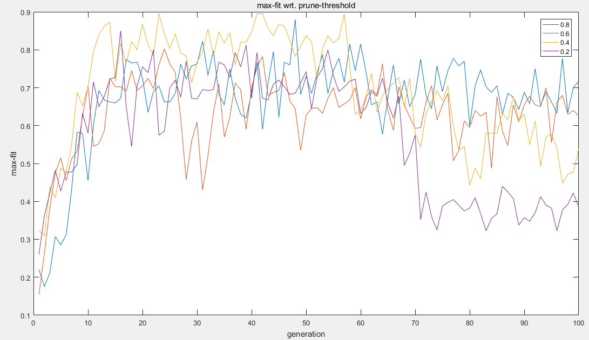
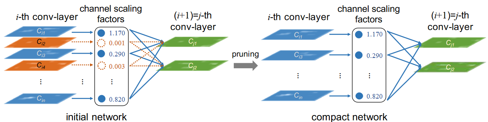
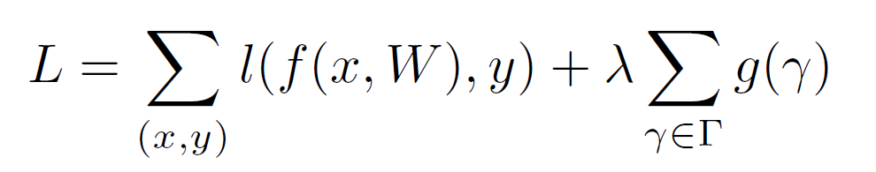

# 2018毕业设计

包含项目描述，参考文献，项目计划，会议总结等内容。

---
- [项目计划](#项目计划)
- [工作总结](#工作总结)
  - [第八周(12.24~12.31)](#第八周12241231) 
  - [第七周(12.16~12.23)](#第七周12161223)
  - [第五六周(12.01~12.15)](#第五六周12011215)
  - [第三四周(11.16~11.30)](#第三四周11161130)
  - [第一二周(11.01~11.15)](#第一二周11011115)
- [会议总结](#会议总结)
     1. [10.26第一次会议](#1026第一次会议)
     2. [10.30第二次会议](#1030第二次会议)
- [项目描述](#项目描述)
- [项目关键技术](#项目关键技术)
---

## 项目计划

　　预计18年11月正式开始毕设，本学期最后一周（1月17日前）完成。

| 时间段          | 计划内容            |
| ------------ | --------------- |
| ~11月18日      | 神经进化、剪枝论文文献资料阅读 |
| 11月19日~12月2日 | 阅读的论文的源码理解、实现   |
| 12月3日~12月18日 | 基础编写代码、功能调试     |
| 12月19日~1月2日  | 代码优化、功能调试       |
| 1月3日~        | 开始着手论文撰写        |


## 工作总结

### 第八周(12.24~12.31)
　　第八周，主要进行代码调参、运行。代码部分增加了将网络参数写回染色体`genome`，对剪枝后的网络进行`retrain`。实验中用到的数据集是`mnist`中训练集和测试集各自的前`400`个样本。

　　首先，再次呈现第七周时在`mnist`小数据集上运行中`CNN`卷积网络神经进化的的平均适应度`mean-fitness`。可以发现，无论是否对结点进行剪枝`prune`(不减枝`prune-prob=0`), 效果都很差。当然，在进化过程中使用了剪枝可以大大提高每一代`genration`迭代的速度，缺点是，在代数足够大的时候，此时网络每一层可能被削减至每一层只有少数几个结点，所以，需要控制好剪枝的概率，使得网络结点增加的概率大于剪枝的概率，避免网络结点锐减。

<center></center>

　　我认为是因为卷积神经网络`CNN`的参数数量过多，神经进化这种方法对卷积层参数做出有益调整难度过大所导致的(实验中用的网络是4层卷积层和三层全连接层`fc`，卷积核大小是`3x3`)，所以，实验结果的`fitness`曲线一直在上下动荡，没有向好的方面发展的趋势。在实验中，人口数量`pop_size = 30`，但是发现个体很难继承到好的基因。

　　因此，我尝试在网络进化过程中，加入`Back Propagation`，人口数量`pop_size=5`。每一代中，每个个体都会训练2个`epoches`。同时，每一代中，每个个体都有可能被剪枝`prune`(通过结点剪枝抑制网络结点数量的增加)，调整剪枝的阈值`prune_threshold`(0到1之间)，被剪枝的个体会多训练2个`epoches`作为对剪枝`prune`的`retrain` ,调整剪枝的阈值`prune_threshold`，得到如下每一代(100代)中平均适应度`mean-fit`的结果。
<center></center>

　　可以看出，加入`BP`后，虽然人口数量从`30`削减至`5`, 但训练的速度和效果大幅度提高。对于上面的四种不同的剪枝概率，只需迭代`40`代，平均适应度都能达到`0.7`以上。同时，对应的最大适应度`max-fit`可以达到`0.8` (对比图如下) 。

　　此外，当代数`generation`大于60后，适应度均出现较明显下滑，剪枝阈值`prune-threshold`越低，现象越严重，一方面是因为过拟合`over-fitting`，另一方面，是因为`prune-threshold`对网络结点的削减导致，例如，在`prune-threshold=0.2`时，剪枝概率过大(为`1-0.2 = 0.8`)，所以，随着代数增加，必然出现网络结点锐减的现象。

<center></center>


### 第七周(12.16~12.23)

　　第七周，我阅读了神经进化库 `neat-python`使用文档及其源码。经过对源码的研读，我发现，`neat-python`库只能进化只包含全连接层`fc`的神经网络，而不能进化包含卷积层`cnn layer`的网络。因此，为了能够进化卷积神经网络`cnn`, 我基于`pytorch`, 对`neat-python`的源码进行了修改，使得它也能进化卷积神经网络`cnn`。

  1. 首先，需要给结点基因`node_gene`增加卷积核属性`kernal`, 对于某一层的所有卷积核，这是一个四维(`out_channel x in_channel x kernal_size x kernal_size`)的属性。我们可以把最后两维度合并成大小为`kernal_size x kernal_size `的一维。对于`out_channel`的每一个 结点，只需要存储二维的`in_channel x new_kernal_size`。我使用二维的列表`[ [ ], [], ... ]` 来存储，我在`neat-python` 源码中的模块`attributes.py`中，新增了`ListAttribute`来表示这个二维的列表。

  2.  在`gene.py` 的默认结点基因`DefaultNodeGene`中, 增加了 属性`ListAttribute('kernal')`， 即每个结点对上一层所有结点的卷积核。同时，增加`self.in_nodes = []`  记录卷积层结点的 输入channels。

  ```python
class DefaultNodeGene(BaseGene):
         _gene_attributes = [FloatAttribute('bias'),
                             FloatAttribute('response'),
                             StringAttribute('activation', options='sigmoid'),
                             StringAttribute('aggregation', options='sum') ,
                             ListAttribute('kernal') # add
                             ]
         def __init__(self, key, layer ):
             assert isinstance(key, int), "DefaultNodeGene key must be an int, not {!r}".format(key)
             BaseGene.__init__(self, key)                
             self.in_nodes = [] # add 卷积层结点的 输入channels       
             self.layer = layer
  ```


　　3. 在复制结点基因`DefaultNodeGene`时，需要对`in_nodes`和`kernal` 进行深拷贝。

  ```python
 def copy(self):
         if isinstance(self, DefaultNodeGene):             
             new_gene = self.__class__(self.key, self.layer) # 这里对 new_gene.layer赋值
         else:            
             new_gene = self.__class__(self.key)         
         for a in self._gene_attributes:
             setattr(new_gene, a.name, getattr(self, a.name))
         # Add    
         if isinstance(self, DefaultNodeGene):              
             new_gene.in_nodes = self.in_nodes.copy()            
             new_gene.kernal = self.kernal.copy() 
             assert len(new_gene.in_nodes) == len(self.in_nodes)                
         return new_gene
  ```


　　4. 在结点基因交叉`crossover`时，增加对`kernal`的交叉。对于 `self` 的每一个卷积核`kernal[i]`，寻找`gene2`中是否有与之同源的连接，即`gene2.in_nodes[j] == self.in_nodes[i]`，对同源的`kernal[i]` 进行一定概率的交叉。

   ```python
   def crossover(self, gene2):
       """ Creates a new gene randomly inheriting attributes from its parents."""   
            #  add 
            for a in self._gene_attributes:            
                if (random() < 0.2):                
                    if (a.name == 'kernal'):                  
                         for i in range(len(self.in_nodes)):
                             if random() < 0.5:
                                 continue
                              for j in range(len(gene2.in_nodes)):
                                  if gene2.in_nodes[j] == self.in_nodes[i]:                        
                                      for k in range(len(self.kernal[0])):                           
                                          lamda = random()
                                          new_gene.kernal[i][k] = \
                                              lamda * self.kernal[i][k] + \
                                              (1 - lamda) * gene2.kernal[j][k]
             return new_gene
	     
   ```

    5. 结点基因也可以进行变异`mutate`，对于每一个属性`a.name`，变异时，都会调用相应属性的`a.mutate_value`函数，新增的相应代码位于`attribute.py`的`ListAttribute`中。

   ```python
  def mutate(self, config):
             for a in self._gene_attributes:
                 v = getattr(self, a.name)
                 setattr(self, a.name, a.mutate_value(v, config))
   ```

　　6. 在个体(即染色体)`genome.py`中，配置新的个体`configure_new` 时，用`self.layer`记录每一层的结点集合。根据配置文件`config`要求的卷积层数量`num_cnn_layer` 、全连接层数量`num_layer - num_cnn_layer` 、初始结点数量、输入输出结点个数等来配置初始个体。

   ```python
   def configure_new(self, config):
             """Configure a new genome based on the given configuration."""
             # Create cnn layer & fc layer
             for i in range(config.num_cnn_layer):
                 self.layer.append(['cnn', set()])
             for i in range(config.num_cnn_layer, config.num_layer):
                 self.layer.append(['fc', set()])
                 
             for node_key in config.output_keys: # Create node genes for output nodes
                 self.nodes[node_key] = self.create_node(config, node_key, config.num_layer - 1)     
             # layer[-1][0]: 最后一层的 类型 : 'cnn' 或 'fc'
             # layer[-1][1]: 最后一层 的 set()
             self.layer[-1][1] = set(config.output_keys) # Add output layer nodes
                     
             hidden_node_key = set() # Add hidden nodes if requested
             if config.num_hidden > 0:
                 for i in range(config.num_hidden):
                     node_key = config.get_new_node_key(self.nodes)
                     assert node_key not in self.nodes                
                     node = self.create_node(config, node_key, -198043)
                     self.nodes[node_key] = node
                     hidden_node_key.add(node_key)
             # Assign nodes to layers, make sure every layer has at least one node
             if (len(hidden_node_key) >= config.num_layer - 1):
                 for i in range(config.num_layer - 1):                
                     node_key = hidden_node_key.pop()                
                     # 每一层i放一个结点node_key
                     self.layer[i][1].add(node_key)
                     self.nodes[node_key].layer = i
             else:
                 raise RuntimeError("Too less nodes.")
     
             # Assign nodes to the first fc layer.
             # (The first fc layer already has one node, so add num_first_fc_layer_node - 1 nodes.
             if (config.num_first_fc_layer_node > 0) and (len(hidden_node_key) >= config.num_first_fc_layer_node - 1):
                 for i in range(config.num_first_fc_layer_node - 1):                
                     node_key = hidden_node_key.pop()                
                     # 第一个fc层 再放 num_first_fc_layer_node-1 个 结点                
                     self.layer[config.num_cnn_layer][1].add(node_key)
                     self.nodes[node_key].layer = config.num_cnn_layer        
             elif config.num_first_fc_layer_node > 0: # 如果隐藏层结点不够满足第一个fc层的结点数要求
                     raise RuntimeError("Too less nodes.")
             
             while hidden_node_key: # 剩下的node 随机分配给每一层
                 layer_nums = randint(0, config.num_layer - 2)            
                 node_key = hidden_node_key.pop()            
                 self.layer[layer_nums][1].add(node_key)
                 self.nodes[node_key].layer = layer_nums   
   ```


　　7. 在初始完每一层的结点后，需要建立连接`connection`。由于初始连接不一定是全连接，因此，需要先计算所有可能的连接(这里考虑相邻两层的全连接)的函数`compute_full_connections_with_layer`，再从中选择一部分连接。

   ```python
  def compute_full_connections_with_layer(self, config):        
             connections = []  # 所有可能的连接
             in_channels = {}  # 结点node的入度       
             for node in self.layer[0][1]:
                 for input_id in config.input_keys:
                     #print(input_id, ' -- > ' , node)                
                     connections.append((input_id, node))                
                     if in_channels.__contains__(node) == False: 
                         in_channels[node] = 1 # 结点node的入度in
                     else:
                         in_channels[node] += 1                         
             for i in range(len(self.layer) - 1):# 第一层 到 倒数第二层
                  for node1 in self.layer[i][1]: # 第 i层的每个结点node1
                         for node2 in self.layer[i+1][1]:# 第 i+1层的每个结点node2
                             connections.append((node1, node2))                        
                             # 计算 全连接的情况下, 每个 卷积层结点 node2的输入通道数 
                             if i + 1 < config.num_cnn_layer:                            
                                 if in_channels.__contains__(node2) == False: 
                                     in_channels[node2] = 1
                                 else:
                                     in_channels[node2] += 1                                
             # 如果 有环, in_channels 可能要修改                                
             # For recurrent genomes, include node self-connections.
             if not config.feed_forward:
                 for i in iterkeys(self.nodes):
                     connections.append((i, i))
             return connections, in_channels
   ```

　　8. 在选择部分连接的函数`connect_partial`编写如下，选择一部分连接加入到`self.connections`中，同时更新结点的入度信息`in_nodes`。

  ```python
def connect_partial(self, config):
             """
             Create a partially-connected genome,
             with (unless no hidden nodes) no direct input-output connections."""
             assert 0 <= config.connection_fraction <= 1        
             all_connections, in_channels = self.compute_full_connections_with_layer(config)        
             shuffle(all_connections)        
             num_to_add = int(round(len(all_connections) * config.connection_fraction))        
             #  deleted connections
             for in_id, output_id in all_connections[num_to_add:]:
                 if in_id < 0: # input node    
                     self.nodes[output_id].in_nodes.append(in_id)
                     #print('in_id' ,in_id ,' -> ', output_id)
                     connection = self.create_connection(config, in_id, output_id)
                     self.connections[connection.key] = connection
                     continue
                 if in_channels.__contains__(output_id):                
                     in_channels[output_id] -= 1            
                     if in_channels[output_id] == 0:
                         del in_channels[output_id]                                        
             for input_id, output_id in all_connections[:num_to_add]:
                 connection = self.create_connection(config, input_id, output_id)
                 self.connections[connection.key] = connection            
                 if in_channels.__contains__(output_id): # output_id  is cnn node               
                     self.nodes[output_id].in_nodes.append(input_id)
     
             for node_id, in_num in in_channels.items():            
                 if in_num < 2:
                     continue # 保证 in_num -1 >= 1 即 in_num >= 2
                 # 补全 (in_num, len(kernal[0]))
                 tmp = randn(in_num-1, len(self.nodes[node_id].kernal[0]))                        
                 self.nodes[node_id].kernal += tmp.tolist()               
                 assert len(self.nodes[node_id].kernal) == len(self.nodes[node_id].in_nodes)   
  ```

　　9. 选择全连接的函数`connect_full`如下,等价于上面函数`connect_partial`中`config.connection_fraction=1`的情况。

  ```python
         def connect_full(self, config):
             """Create a fully-connected cnn genome"""       
             connects, in_channels = self.compute_full_connections_with_layer(config)        
             for node1, node2 in connects:                        
                 connection = self.create_connection(config, node1, node2)
                 self.connections[connection.key] = connection            
                 if in_channels.__contains__(node2): # node2 is cnn                       
                     self.nodes[node2].in_nodes.append(node1)                   
             for node_id, in_num in in_channels.items(): # for each cnn node
                 if in_num < 2:
                     continue
                 # 补全 (in_num, len(kernal[0]))
                 tmp = randn(in_num-1, len(self.nodes[node_id].kernal[0]))                        
                 self.nodes[node_id].kernal += tmp.tolist()                        
                 assert len(self.nodes[node_id].kernal) == len(self.nodes[node_id].in_nodes)  
  ```

　　10. 变异增加一个结点`mutate_add_node`。

  ```python
      def mutate_add_node(self, config):        
              # randint(a,b) 左右都是闭区间[a,b]                        
              layer_num = randint(0, config.num_layer - 2)        
              new_node_id = config.get_new_node_key(self.nodes)
              ng = self.create_node(config, new_node_id, layer_num)
              self.layer[layer_num][1].add(new_node_id)
              self.nodes[new_node_id] = ng
              
              # if the added node in first layer
              if layer_num == 0: 
                  # TODO: 确保第一层是 卷积层, 才需要 设置 kernal 和 in_nodes
                  #assert config.num_cnn_layer > layer_num            
                  # Add full connection between input and the first layer
                  if config.full_connect_input:                                
                      for input_id in config.input_keys:
                          connection = self.create_connection(config, input_id, new_node_id)
                          self.connections[connection.key] = connection                               
                          if config.num_cnn_layer > layer_num:
                              self.nodes[new_node_id].in_nodes.append(input_id)
                              #print(new_node_id, ' fc-inputs in_nodes -> ', input_id)               
                      if config.num_cnn_layer > layer_num:                            
                          in_num = len(config.input_keys)                
                          if in_num > 1:    
                              # 补全 (in_num, len(kernal[0]))
                              tmp = randn(in_num-1, len(self.nodes[new_node_id].kernal[0]))           
                              self.nodes[new_node_id].kernal += tmp.tolist()                         
                          assert len(self.nodes[new_node_id].kernal) == len(self.nodes[new_node_id].in_nodes)                                                                                    
                  # Add one connction between input and the first layer
                  else:
                      input_id = choice(config.input_keys)
                      connection = self.create_connection(config, input_id, new_node_id)
                      self.connections[connection.key] = connection
                      if config.num_cnn_layer > layer_num:                   
                          self.nodes[new_node_id].in_nodes.append(input_id)
                          assert len(self.nodes[new_node_id].in_nodes) == 1                
              # Not the first layer node, and one connection to a node in the former layer
              else:
                  node_id = choice(list(self.layer[layer_num - 1][1]))
                  connection = self.create_connection(config, node_id, new_node_id)
                  self.connections[connection.key] = connection
                  
                  if config.num_cnn_layer > layer_num:
                      self.nodes[new_node_id].in_nodes.append(node_id)
                      #print(new_node_id, ' in_nodes -> ', node_id)
                      assert len(self.nodes[new_node_id].in_nodes) == 1        
              # 如果是最后一层fc层
              if layer_num == config.num_layer - 1:            
                  # -> output node
                  for node_id in list(self.layer[-1][1]):
                      connection = self.create_connection(config, new_node_id, node_id)
                      self.connections[connection.key] = connection                               
              else:
                  # Add one connection to a node in the after layer
                  node_id = choice(list(self.layer[layer_num + 1][1]))
                  connection = self.create_connection(config, new_node_id, node_id)
                  self.connections[connection.key] = connection
                  
                  if config.num_cnn_layer > layer_num + 1: # 下一层还是 cnn层
                      self.nodes[node_id].in_nodes.append(new_node_id)                
                      if len(self.nodes[node_id].in_nodes) > 1:                   
                          tmp = randn(1, len(self.nodes[node_id].kernal[0]))                    
                          self.nodes[node_id].kernal += tmp.tolist()                                 
                      assert len(self.nodes[node_id].kernal) == len(self.nodes[node_id].in_nodes)  
  ```

　　11. 增加连接的函数`mutate_add_connection`，如果直接的连接`key=(in_node, out_node)`中`out_node`位于卷积层，则需要为结点 out_node` 增加一个卷积核，以及更新入度信息` `in_nodes` 。

   ```python
   def mutate_add_connection(self, config):        
              layer_num = randint(0, config.num_layer - 1)  # Choose outnode layer
              if layer_num == 0:
                  out_node = choice(list(self.layer[layer_num][1]))
                  in_node = choice(config.input_keys)
              else:
                  out_node = choice(list(self.layer[layer_num][1]))
                  in_node = choice(list(self.layer[layer_num - 1][1]))        
              key = (in_node, out_node)
              ''' 省略中间连接可行性的判断 '''
              cg = self.create_connection(config, in_node, out_node)
              self.connections[cg.key] = cg   # 新建连接     
              if layer_num < config.num_cnn_layer:                                    
                  tmp = randn(1, len(self.nodes[out_node].kernal[0]))  # 更新卷积核kernal           
                  if len(self.nodes[out_node].in_nodes) > 0:                                       
                      self.nodes[out_node].kernal += tmp.tolist()  
                  else:
                      self.nodes[out_node].kernal = tmp.tolist() # 重新赋值                
                  self.nodes[out_node].in_nodes.append(in_node) # 更新入度信息
   ```


　　12. 删除一个隐藏层结点`mutate_delete_node`，与该结点相连的连接需要跟随结点`del_key`一起删除。

  ```python
  	def mutate_delete_node(self, config):        
              # 只能删除隐藏层结点
              available_nodes = [k for k in iterkeys(self.nodes) if k not in config.output_keys]
              if not available_nodes:
                  return -1
              del_key = choice(available_nodes)
              # If there is only one node
              if len(self.layer[self.nodes[del_key].layer][1]) <= 1:
                  return -1        
              connections_to_delete = set() # 需要跟随结点del_key一起删除的连接
              for k, v in iteritems(self.connections):
                  # v=(a,b), either del_key == a or b should be deleted
                  if del_key in v.key:
                      connections_to_delete.add(v.key)                
              for key in connections_to_delete:
                  if key[0] == del_key: # del_key是 输入
                      idx = -1                
                      for i in range(len(self.nodes[key[1]].in_nodes)): 
                          if self.nodes[key[1]].in_nodes[i] == key[0]:
                              idx = i    
                              break
                      assert idx > -1                
                      self.nodes[key[1]].in_nodes = self.nodes[key[1]].in_nodes[:idx] + \
                          self.nodes[key[1]].in_nodes[idx+1 : ]
                      # TODO: 保证 结点至少有一个kernal                     
                      if len(self.nodes[key[1]].in_nodes) > 0:                    
                          self.nodes[key[1]].kernal = self.nodes[key[1]].kernal[:idx] + \
                              self.nodes[key[1]].kernal[idx+1:]                                               
                  else: # key[1] == del_key               
                      self.nodes[del_key].in_nodes = []
                      self.nodes[del_key].kernal = self.nodes[del_key].kernal[:1]                                                    
                  del self.connections[key]        
              self.layer[self.nodes[del_key].layer][1].remove(del_key)
              del self.nodes[del_key]
              return del_key
  ```


　　13. 在`evaluate_torch.py`中，实现了将个体(染色体)`genome`翻译成卷积神经网络。`set_layers`设置每一层的结点。
  ```python
      def set_layers(self, genome: neat1.genome.DefaultGenome):        
              cnn_channel = list() #calculate channel for every cnn layers
              cnn_channel.append(self.num_inputs) # 输入图片RGB的通道数 num_inputs=3        
              for i in range(self.num_cnn_layer):
                  # 每一层卷积层的卷积核数量=num_feature_map=输出的通道数=第i层结点数量
                  cnn_channel.append(len(genome.layer[i][1]))
              #add cnn layers
              layer_id = 0
              for i in range(self.num_cnn_layer):           
                  self.add_module(str(layer_id), nn.Conv2d(in_channels = cnn_channel[i], out_channels = cnn_channel[i+1], kernel_size = 3, padding = 1))
                  layer_id += 1                        
              
              fc_channel = list() #calculate channel for every cnn layers                 
              # nn.AvgPool(4)(x) 全局平均池化
              self.num_flat_features = len(genome.layer[self.num_cnn_layer-1][1])                                                 
              # 每一层 fc层的结点数量
              fc_channel.append(self.num_flat_features)                        
              for i in range(self.num_cnn_layer, self.num_layer):
                  fc_channel.append(len(genome.layer[i][1]))
              #add fc layer
              for i in range(self.num_layer - self.num_cnn_layer):
                  self.add_module(str(layer_id), nn.Linear(fc_channel[i], fc_channel[i+1]))
                  layer_id += 1
              #set all weight and bias to zero
              for module in self.children():
                  module.weight.data.fill_(0.0)
                  module.bias.data.fill_(0.0)
  ```

  　　14. `set_parameters`将连接基因`connection gene`的权重`weight`和结点基因`node gene`的卷积核`kernal`的值放入网络中(全连接层`fc`的结点的卷积核不会用到)。


```python
  def set_parameters(self, genome: neat1.genome.DefaultGenome):
          layer = list(self.children())#make sure change layer can affect parameters in cnn
          nodes = {}
          #add the input node to nodes dict
          order = 0 # order 是 结点在当前层layer的下标
          for i in range(-self.num_inputs, 0):
              position = [-1, order]   #-1 means input node
              nodes.update({i: position})
              order += 1
          #add every layers to nodes dict
          for i in range(self.num_layer):            
              l = list(genome.layer[i][1]) # l是 结点 id 的 list
              l.sort()
              order = 0
              for j in range(len(l)):            
                  #add node (id, [layer, order in layer])
                  position = [i, j]
                  # l[j]: id of the jth node in ith layer
                  nodes.update({l[j]: position})                
                  if i < self.num_cnn_layer:  #add conv kernel and bias to pytorch module         
                      a = np.array(self.old_nodes[l[j]].kernal)
                      if (len(self.old_nodes[l[j]].in_nodes) == 0 or len(self.old_nodes[l[j]].in_nodes) == len(a)) == False:
                          print('layer %d , %d -th ,node_id %d '%(i, j ,l[j]))
                          print(len(self.old_nodes[l[j]].in_nodes), ' ',len(a) )
                      assert len(self.old_nodes[l[j]].in_nodes) == 0 or len(self.old_nodes[l[j]].in_nodes) == len(a)
  
                      if i == 0 and len(self.old_nodes[l[j]].in_nodes) == 0:
                          print(str(l[j]) , ' no_input to first cnn layer')                        
                      if len(self.old_nodes[l[j]].in_nodes) > 0:                        
                          for k in range(len(a)):
                              layer[i * 1 + 0 ].weight.data[j][nodes[ self.old_nodes[l[j]].in_nodes[k]][1] ] = \
                                 torch.FloatTensor(a[k].reshape(3, 3))                                        
                      b = self.old_nodes[l[j]].bias              
                      layer[i + 0 ].bias.data[j] = torch.FloatTensor([b])                   
                  else:
                      b = self.old_nodes[l[j]].bias
                      layer[i + 0 ].bias.data[j] = torch.FloatTensor([b])                            
          self.nodes = nodes.copy()               
          for in_node, out_node in genome.connections:
              # 输出结点所在的层layer                
              c = nodes[out_node][0] #layer number            
              if c < self.num_cnn_layer: #cnn layer
                  pass                            
              elif c != self.num_cnn_layer:
                  layer_num = 0 + c               
                  weight_tensor_num = nodes[out_node][1]
                  weight_num = nodes[in_node][1]                
                  (layer[layer_num].weight.data[weight_tensor_num])[weight_num] = \
                      torch.FloatTensor([genome.connections[(in_node, out_node)].weight])                                   
              else:               
                  layer_num = 0 + c                
                  weight_tensor_num = nodes[out_node][1]                
                  weight_num  = nodes[in_node][1]                
                  (layer[layer_num].weight.data[weight_tensor_num])[weight_num] = \
                      torch.FloatTensor([genome.connections[(in_node, out_node)].weight])                                    

```

15. 网络的前向传播`forward`如下。

```python
  class Net(nn.Module):            
      def forward(self, x):
          l = list(self.children())        
          for i in range(self.num_cnn_layer):            
              x = l[1 * i](x)
              x = nn.BatchNorm2d(num_features=x.shape[1])(x)            
              x = F.relu(x)
              x = F.max_pool2d(x, 2)                     
          #x = nn.AvgPool2d(2)(x)   # 平均池化         
          x = x.view(-1, x.shape[1]*x.shape[2]*x.shape[3])               
          # final fc-layer  is not activated            
          for i in range(self.num_cnn_layer, self.num_layer - 1):            
              x = F.relu(l[i + 0](x))            
          bn = nn.BatchNorm1d(num_features=10)
          x = l[-1](x)         
          x = bn(x)        
          return x
```

16. 在`mnist`数据集上，进行了简单的测试。生成的网络如下：

      <center></center>

17. 对生成的网络进行按结点剪枝(减去`50%`)，得到的剪枝后的网络如下。同时，将剪枝后的网络写回去染色体`genome`中去，再用`genome`生成一个新的网络，一方面验证新生成的网络的性能，也说明了从染色体到网络之间的可逆性。

    <center></center>
18. 在`mnist`上截取的小数据集上，进行了测试，进化`600`代，每一代的每一个个体都有一定的概率被剪枝(根据结点权重weight的`L2-norm`选择删去的结点)，运行结果(每一代`generation`的最大适应度`best-fitness` 和 平均适应度 `mean-fitness`)如下：
<center></center>

19. 与进化过程中不减枝`prune-prob=0`的平均适应度的对比如下。
<center></center>

### 第五六周(12.01~12.15)

　　我首先对前两周阅读的论文(<a href="<https://arxiv.org/pdf/1608.08710.pdf>">Pruning Filters For Efficient Convnets</a>,  <https://arxiv.org/pdf/1608.08710.pdf>)中的网络剪枝算法在更深的网络`vgg`  和结构更复杂的网络 `resnet` 上进行代码重现。

　　此外，阅读了另一篇卷积神经网络剪枝论文(<a href="<https://arxiv.org/pdf/1608.08710.pdf>">Learning Efficient Convolutional Networks through Network Slimming</a>,  链接: http://openaccess.thecvf.com/content_ICCV_2017/papers/Liu_Learning_Efficient_Convolutional_ICCV_2017_paper.pdf)，研究了 https://github.com/Eric-mingjie/rethinking-network-pruning对论文的剪枝算法在 `vgg` 和 `resnet` 上重现。

#### 论文阅读

　　上述论文提出，在选择卷积层特征图`feature map`中减去的通道`channel`时，除了可以通过`L1_norm` 来评估通道的重要性，还可以通过给每一个通道`channel`一个可训练的参数`channel scaling factor`来衡量通道的重要性，即每个通道的输出值都会被乘以这个参数后传递到下一层，如果`scaling factor`很小，说明通道的重要性低，可以剪掉(下图中，橙色的通道的`scaling factor`接近`0`，可以被剪掉)。

　　值得注意的是，在`CNN`中，卷积层之后一般会伴随着一层批量归一化层`BatchNorm`层，而论文中 提到的`channel scaling factor`的功能恰好和`BatchNorm`层的参数`scaling factor`功能一致。

　　所以，可以直接用`BatchNorm`层自带的`scaling factor`(一般用$\gamma$ 表示) 来衡量通道`channel` 的重要性，这样做，不会引入新的参数。

<center></center>


　　训练时，损失函数`L`加上`scaling factor`( $\gamma $ )的损失值$\lambda \sum_{\gamma \in \Tau} g(\gamma)$，这里定义$g(\gamma) = |\gamma|$，即`scaling factor`( $\gamma $ )的绝对值。

<center></center>


#### 代码实现

```python
# 批量归一化BatchNorm层的梯度更新，需要 加上 lambda* sign(scaling factor)
def updateBN():
    for m in model.modules():
        if isinstance(m, nn.BatchNorm2d):
            m.weight.grad.data.add_(args.s*torch.sign(m.weight.data))  # L1
```

　　由于`vgg`不包含跳跃连接结构，在此只介绍较为复杂的`resnet`网络。

　　`resnet`的一个基本模块`BasicBlock` 如下，每个模块包含两个卷积核大小为`3*3` 的卷积层`conv`，由于`padding=2`, 经过一个`BasicBlock`后，图片的输入和输出的`height`、 `width`不变。

```python
    # BaicBlock的 前向传播
    def forward(self, x):
        residual = x
        if self.downsample is not None:
            residual = self.downsample(x) # 对输入x和 经过BaicBlock的输入out进行维度匹配
            
        out = self.bn1(self.conv1(x))               
        out = self.relu(out)        
        out = self.bn2(self.conv2(out))        
       
        out = self.relu(out + residual) # 加上identity map项 residual
        return out
```


```python
# 一个输入16通道，输出16通道 的BasicBlock，conv1和conv2之间的通道数为12，对于模块外，只需关注输入输出的通道数
BasicBlock(
      (conv1): Conv2d(16, 12, kernel_size=(3, 3), stride=(1, 1), padding=(1, 1), bias=False)
      (bn1): BatchNorm2d(12, eps=1e-05, momentum=0.1, affine=True, track_running_stats=True)
      (relu): ReLU(inplace)
      (conv2): Conv2d(12, 16, kernel_size=(3, 3), stride=(1, 1), padding=(1, 1), bias=False)
      (bn2): BatchNorm2d(16, eps=1e-05, momentum=0.1, affine=True, track_running_stats=True)
    )
```

　　以`resnet14` 为例，每个`BaicBlock`表示成`(input_channels, output_channels)`的形式。可以看出，在同一个`layer`中, 相邻`BasicBlock`的通道数 一般保持不变。只在不同的层数`layer` 的间隙处，才进行通道数的加深(16到32， 32到64)。这样做是为了保证同一个`layer`中，在进行跳跃连接`skip` 时，通道数和长宽(在跨越不同`layer`时，一般会用`stride=2`减小长宽)保持一致。

```python
# resnet14 的结构： 3 layer， 2 Block per layer
ResNet(
  (conv1): Conv2d(3, 16, kernel_size=(3, 3), stride=(1, 1), padding=(1, 1), bias=False)  
  (layer1): Sequential(
    (0): BasicBlock(16,16)
    (1): BasicBlock(16,16)     
  )
  (layer2): Sequential(
    (0): BasicBlock(16,32)            
    (1): BasicBlock(32,32)    
  )
  (layer3): Sequential(
    (0): BasicBlock(32,64)     
    (1): BasicBlock(64, 64)     
  )
  (avgpool): AvgPool2d(kernel_size=8, stride=8, padding=0)
  (fc): Linear(in_features=64, out_features=10, bias=True)
)
```

　　`resnet`中，有另一种基本模块`Bottleneck`，利用`1x1` 的卷积核来改变通道数，用于减少参数数量。

<center> </center>


```python
# BottleNeck模块的前向传播
def forward(self, x):
     residual = x
	 if self.downsample is not None:
         residual = self.downsample(x)       
    out = self.bn1(x)
    out = self.select(out)  # 利用batchnorm层的scaling factor进行通道选择                  
    out = self.conv1(out)  # bn1 对 该层的输入进行剪枝  
    
    out = self.bn2(out)     
    out = self.conv2(out)  # bn2 对 该层的输入进行剪枝   
    
    out = self.bn3(out) 
    out = self.conv3(out)  # bn3对该层输入剪枝，该conv层输入的通道数减少, 输出通道不变      
    out += residual
    return out
```

　　一个`Bottleneck`举例如下：

```python
Bottleneck(
      (bn1): BatchNorm2d(16)
      (select): channel_selection() # 根据bn1的scaling fator 选择通道剪枝，剪 conv1的输入
      (conv1): Conv2d(8, 7, kernel_size=(1, 1), stride=(1, 1), bias=False)
      (bn2): BatchNorm2d(7) # 剪去 conv1的输出
      (conv2): Conv2d(7, 10, kernel_size=(3, 3), stride=(1, 1), padding=(1, 1), bias=False)
      (bn3): BatchNorm2d(10)
      (conv3): Conv2d(10, 64, kernel_size=(1, 1), stride=(1, 1), bias=False)
      (relu): ReLU(inplace)
      (downsample): Sequential( # 匹配残差模块的维度
        (0): Conv2d(16, 64, kernel_size=(1, 1), stride=(1, 1), bias=False)
      )
```
### 第三四周(11.16~11.30)

　　第三四周期间，我阅读了一些神经网络剪枝(Neural Network Pruning)的文献。

　　并且，基于用`Python` 的`Pytorch`库，重现了论文中的剪枝算法(包括对卷积层`conv2d`的剪枝 和对全连接层`Linear`的剪枝)。

#### 论文阅读

　　对我影响最重大的一篇论文是研究卷积神经网络`CNN`的剪枝算法(<a href="<https://arxiv.org/pdf/1608.08710.pdf>">Pruning Filters For Efficient Convnets</a>,  链接是<https://arxiv.org/pdf/1608.08710.pdf>)。

　　论文的核心思想如下：

　　1. 从减少网络计算量(computation costs)、减少网络运行时间的角度，对卷积层`Conv2d`的剪枝比对全连接层`full connected`更重要，因为卷积操作更耗时。论文聚焦于对卷积层的剪枝(论文提出的剪枝方法对全连接层的剪枝也非常适应)。

　　2.为避免剪枝对网络结点间的密集连接`Dense`关系的破坏，论文指出对特征图`feature map` (即通道`channel`，也即对卷积核`kernel`剪枝)进行剪枝操作，剪枝操作会去掉$L1\_norm$ 较小的特征图。

　　下图中，$X_{i+1}$ 是当前卷积层的输入`input`，$X_{i+2}$ 是当前卷积层的输出`output`，也是下一层卷积层的输入`input`。$n_{i+1}$ 是当前卷积层的输入的通道数`channels`(也即输入的特征图`feature map` 的个数)，$n_{i+2}$ 是当前卷积层输出的通道数`channels`。

　　图中的$n_{i+1}*n_{i+2}$ 的矩阵是权重矩阵$W_{L+1}$，每一个小矩形都是一个$(kernel\_size, kernel\_size  )$的卷积核`kernel`。

<center> </center>

  3. 每减去一张特征图，即减少了一个通道`channel`，会对当前卷积层的权重矩阵$W_L$和下一层卷积层的权重矩阵$W_{L+1}$ 减少一行或一列，这样使得剪枝后的网络还是处于密集连接的状态。

     　　

#### 代码重现

1. weight-pruning(全连接层剪枝)

   从实现对简单的三层全连接层网络`full connected`进行剪枝开始。选取的数据集是`mnist`数据集，输入图片是单通道是$(28,28)$ 图片，因此网络输入大小为$28*28=784$。 　

   ```python
   层数 类型
   1   MaskedLinear(in_features=784, out_features=200, bias=True)
   2   ReLU(inplace)
   3   MaskedLinear(in_features=200, out_features=200, bias=True)
   4   ReLU(inplace)
   5   MaskedLinear(in_features=200, out_features=10, bias=True)
   ```

   初始网络的每一层的输出结点个数为 cfg = [200, 200, 10 ]，而剪枝后的目标网络设置为 cfg = [50,100,10]。

    

2. filter-pruning(卷积层剪枝)

　　对有三层卷积层`Conv2d`的网络进行剪枝。选取的数据集还是`mnist`数据集，输入图片是单通道是$(28,28)$ 图片。 　

```python
MaskedConv2d(1, 32, kernel_size=(3, 3), stride=(1, 1), padding=(1, 1))
ReLU(inplace)
MaxPool2d(kernel_size=2, stride=2, padding=0, dilation=1, ceil_mode=False)

MaskedConv2d(32, 64, kernel_size=(3, 3), stride=(1, 1), padding=(1, 1))
ReLU(inplace)
MaxPool2d(kernel_size=2, stride=2, padding=0, dilation=1, ceil_mode=False)

MaskedConv2d(64, 64, kernel_size=(3, 3), stride=(1, 1), padding=(1, 1))
ReLU(inplace)
## 最后一层卷积层的输出 64张7*7的feature map，需要展平成 64*7*7=3136的一维输出
Linear(in_features=3136, out_features=10, bias=True)
```

　　初始网络的每一层卷积层的输出结点个数为 default_cfg = [32, 64, 64 ]，而剪枝后的目标网络卷积层的配置`config`为 cfg = [8,16,32]。

　　和前面对全连接层的剪枝的最大不同是，从卷积层的最后一层到第一层全连接层之间,有一个对卷积层进行`Flatten`的操作，需要特殊处理。

```python
ConvNet(
  (conv1): MaskedConv2d(1, 8, kernel_size=(3, 3), stride=(1, 1), padding=(1, 1))
  (relu1): ReLU(inplace)
  (maxpool1): MaxPool2d(kernel_size=2, stride=2, padding=0, dilation=1, ceil_mode=False)
  (conv2): MaskedConv2d(8, 16, kernel_size=(3, 3), stride=(1, 1), padding=(1, 1))
  (relu2): ReLU(inplace)
  (maxpool2): MaxPool2d(kernel_size=2, stride=2, padding=0, dilation=1, ceil_mode=False)
  (conv3): MaskedConv2d(16, 32, kernel_size=(3, 3), stride=(1, 1), padding=(1, 1))
  (relu3): ReLU(inplace)
   ## 最后一层卷积层的输出 32张7*7的feature map，展平成 32*7*7=1568的一维输出
  (linear1): Linear(in_features=1568, out_features=10, bias=True)
)
```

### 第一二周(11.01~11.15)

　　在第一二周期间，我阅读了一些神经进化和网络剪枝的相关文献。

　　第一篇论文是微生物遗传算法(<a href="Harvey I. The microbial genetic algorithm[J].  2009, 5778:126-133.">The microbial genetic algorithm</a>,我也参考了相关博客对这篇论文的讲解https://blog.csdn.net/ZiTeng_Du/article/details/79613174 )。论文中指出了，在产生新的一代时，一种常用的做法是，在利用当前的种群(current generation)产生下一代(next generation)后，新的种群就取代了原来的种群，这样做的缺点是，交叉变异并不能保证产生的子代的适应度(fitness)较父辈有所提高，有可能丢失了适应度(fitness)很高的个体，新的种群表现可能不如原来的种群。

　　因此，论文提出了另一种更为实用的做法(Steady State Version)，即在选择两个个体作为父母时，保留fitness较高的个体，fitness较差的个体被他们产生的下一代所取代(replace)，所以，我们只需对fitness较差的个体的染色体进行修改即可。这样做，也节省了一些中间变量，实现也较前一种方便。

　　第二篇论文是神经网络剪枝算法(<a href="<http://ieeexplore.ieee.org/stamp/stamp.jsp?tp=&arnumber=8192500&isnumber=8192462>">Scalpel: Customizing DNN pruning to the underlying hardware parallelism</a>,  链接是<http://ieeexplore.ieee.org/stamp/stamp.jsp?tp=&arnumber=8192500&isnumber=8192462>)。论文中指出了，权重剪枝(Weight Pruning)虽然去除了网络中冗余的权重，减小了网络的规模和计算量，但是并不一定能提高网络的运行速度和性能，因为剪枝可能破坏了网络层与层之间结点原本的密集连接关系，使得连接变得稀疏(sparse),而存储这些稀疏连接也需要额外的空间。这一点是值得我们警惕的，因为我们剪枝的目的在于减小网络参数规模，加快网络的运行，同时保证网络性能的相对稳定，如果网络过于稀疏无规律，剪枝的效果会打折扣，达不到我们要的目的。

　　论文提出了用于在并行度低的平台上效果较好的一种网络权重剪枝方法(SIMD-Aware Weight Pruning)，将网络的权重分成若干个大小相同的小组(weights grouping)，计算每个小组权重的均方根值(RMS)，若RMS小于设置好的阈值，则将整个小组去掉，否则保留整个小组。这样，既能保证去除冗余的权重，还能保证剪枝后的网络的结构仍然有规律性，不会像之前那样稀疏无规律。

## 会议总结

### 10.26第一次会议

　　在第一次会议上，我展示了此前阅读的两篇论文《<a href="http://www.ecmlpkdd2018.org/wp-content/uploads/2018/09/108.pdf">Deep Learning Architecture Search by Neuro-Cell-based Evolution with Function-Preserving Mutations (Wistuba, 2018)</a>》和《<a href="http://nn.cs.utexas.edu/keyword?stanley:ec02">Evolving Neural Networks through Augmenting Topologies</a>》。

　　其中，第一篇论文提出了一种基于神经进化(Neuro-Evolution)的深度学习结构搜索的方法，该方法基于遗传算法，使用一系列功能保持(Function-Preserving)的操作来改变神经网络的结构，例如插入一层可分离卷积层、扩宽某一层的结点数(Widening)、产生分支(Branching)、跳跃连接(Skip)等。功能保持，是指在个体发生变异(Mutations)后，对同一输入x，输出y不变，这是通过对突变处的权重进行设置来实现的。接着，会对新生成的网络进行训练，这时就能改变突变处的权重了。论文表明，基于功能保留操作的突变保证了比随机初始化更好的参数初始化，节省网络训练时间。

　　第二篇论文提出了一种叫做"增强拓扑的神经进化(NEAT)"，使得网络结构从简单向复杂进化。一开始，网络只包含输入层和输出层，之后，会逐渐变异、交叉出新的结点和连接。接着，通过自然选择筛选适应度评分(Fitness)神经网络高的网络，淘汰每个物种(Species)中得分偏低的个体(Individuals)。存活下来的个体将通过变异(Mutations)来增加连接(connections)或者增加结点(nodes)。　　

　　对于每个个体(由它所包含的连接(connections)的列表组成)，我们在对同一物种的两个个体进行交叉时，匹配的基因随机遗传。不匹配的基因从fitness更大的parent继承。

　　在会议中，导师指出了，其实这样的交叉操作不能保证产生的后代(Offspring)的适应度得分会更高。而且网络的结点数随着迭代的进行，只会越变越多，导师指出了网络结点是否有变少的可能性。

　　导师对我的展示给予了一些建议，教导我可以将思路放在将同一物种的两个神经网络交叉时，通过剪枝(Pruning)来实现确保交叉后的网络性能有所提高。

### 10.30第二次会议

　　本次会议，我认真吸取了导师的点评之后，确定了选题：基于增强拓扑的神经进化(NEAT)和剪枝(Pruning)来优化神经网络。在交叉时，考虑对父母(Parents)进行剪枝(Pruning)操作，剪去父母中活性低的结点，再交叉产生下一代，以此希望能控制整个网络的参数规模，并在保证网络性能稳定的情况下，加快网络的训练速度。

## 项目描述

　　此项目为基于增强拓扑的神经进化(NEAT)和剪枝(Pruning)来优化神经网络。

　　根据我所阅读的参考文献知，基于NEAT的方法具有全局优化(基于梯度的方法容易陷入局部最优解，而基于神经进化的方法属于全局优化，不容易陷入局部最优解)、减少参数规模(基于NEAT的网络结构是从简单到复杂演化的，参数规模比固定结构的网络更容易控制)，以及超参数自动演化等优点。

　　在我阅读的第二篇论文<a href="http://nn.cs.utexas.edu/keyword?stanley:ec02">Evolving Neural Networks through Augmenting Topologies</a>中，对于两个个体进行交叉(Crossover)的操作是通过神经网络连接(Connections)的对齐来实现的，对于两个个体都存在的连接，随机从一个父母中继承，对于不匹配的连接，则只保留适应度(Fitness)较高的父母的连接。

　　其实，这样的交叉操作不能保证产生的后代(Offspring)的适应度得分会更高。而且网络的结点数随着迭代的进行，只会越变越多，而且不是所有的结点都会发挥作用，我考虑将网络结点数量变少的可能性。在交叉时，考虑对父母(Parents)进行剪枝(Pruning)操作，去除父母中活性低的结点，再产生下一代，以此希望能控制整个网络的参数规模，并在保证总体性能稳定的情况下，加速神经网络的运行。	

## 项目关键技术

1. 基于神经进化(Neuro-Evolution)的深度学习结构搜索的方法

   参考文献：

   <a href="http://www.ecmlpkdd2018.org/wp-content/uploads/2018/09/108.pdf">Deep Learning Architecture Search by Neuro-Cell-based Evolution with Function-Preserving Mutations (Wistuba, 2018)</a>

   http://www.ecmlpkdd2018.org/wp-content/uploads/2018/09/108.pdf

2. 基于增强拓扑的神经进化(NEAT)

   参考文献：

   <a href="http://nn.cs.utexas.edu/keyword?stanley:ec02">Evolving Neural Networks through Augmenting Topologies</a>

   http://nn.cs.utexas.edu/keyword?stanley:ec02
